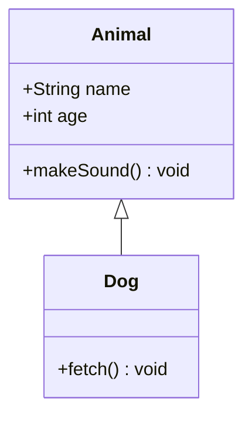
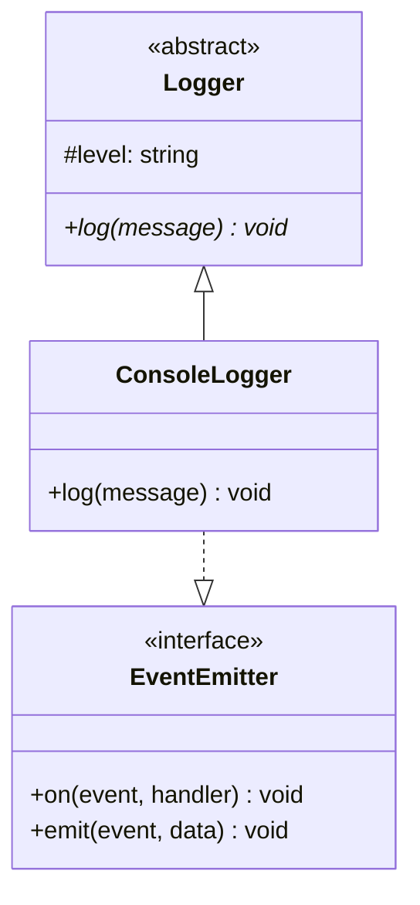
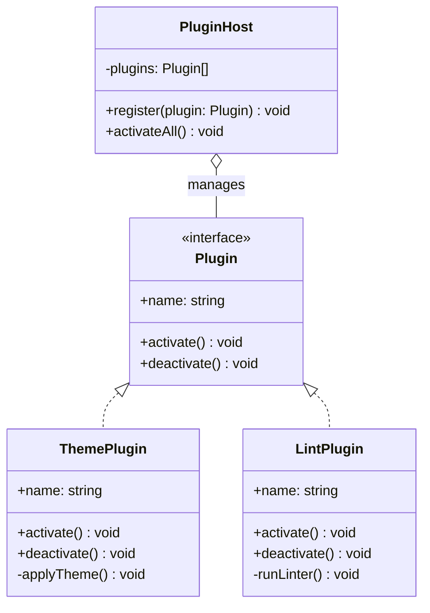
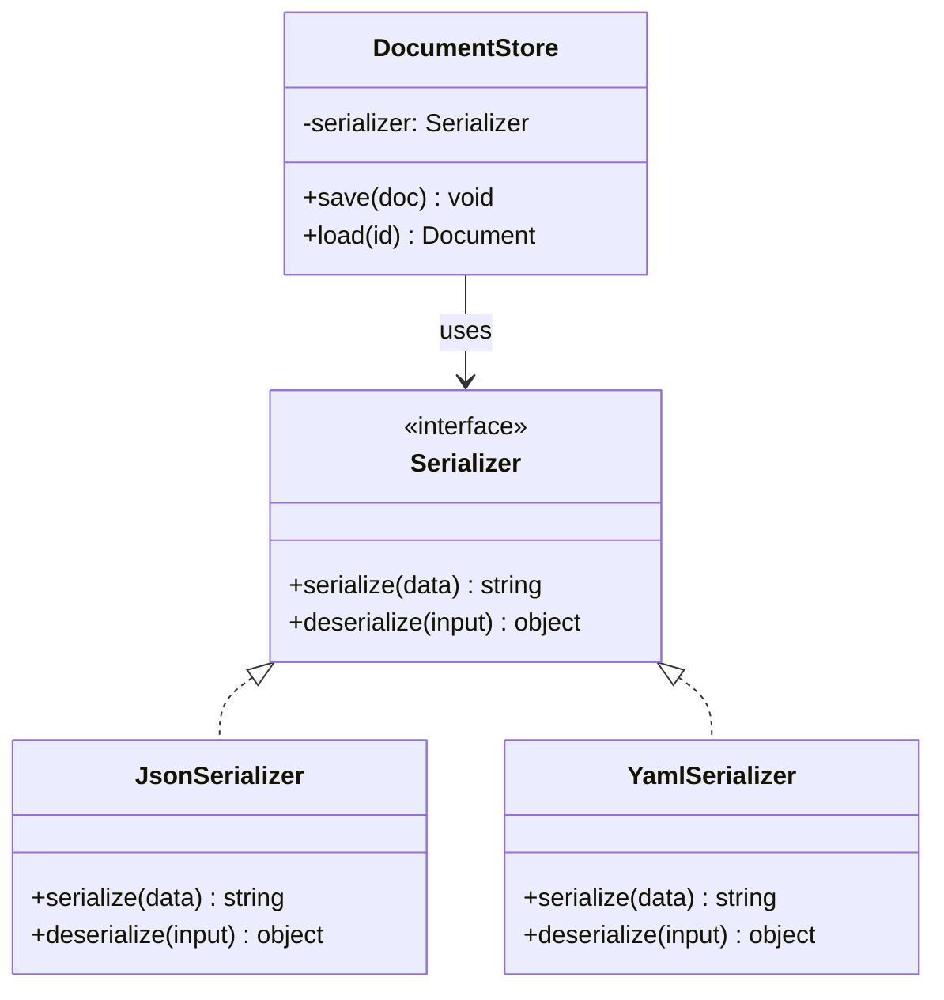

# Class Diagram Guide

## When to Use

Use class diagrams when the plan involves:
- **Object-oriented design** — class hierarchies, inheritance, composition
- **Interface contracts** — defining interfaces and their implementors
- **Type systems** — TypeScript types/interfaces and their relationships
- **Plugin architectures** — abstract base classes and concrete extensions
- **Design patterns** — illustrating patterns like Strategy, Observer, Factory

## Mermaid Syntax

### Basic Structure

````markdown

````

### Visibility Modifiers

| Prefix | Visibility |
|--------|-----------|
| `+` | Public |
| `-` | Private |
| `#` | Protected |
| `~` | Package/internal |

### Relationship Types

| Syntax | Meaning | Use for |
|--------|---------|---------|
| `A <\|-- B` | Inheritance | B extends A |
| `A <\|.. B` | Realization | B implements A |
| `A *-- B` | Composition | B is part of A (lifecycle-bound) |
| `A o-- B` | Aggregation | B belongs to A (independent lifecycle) |
| `A --> B` | Association | A uses B |
| `A ..> B` | Dependency | A depends on B |

### Interfaces and Abstract Classes

````markdown

````

### Generics and Type Parameters

```
class Repository~T~ {
    +findById(id) T
    +save(entity: T) void
}
```

### Cardinality Labels

```
A "1" --> "*" B : contains
```

## Examples

### Plugin Architecture

````markdown

````

### Strategy Pattern

````markdown

````

## Tips

- Use `<<interface>>` and `<<abstract>>` annotations to clarify intent
- Show only the methods and properties relevant to the plan — not exhaustive APIs
- Keep diagrams to 8-10 classes max — split by concern if larger
- Prefer composition (`*--`) over inheritance (`<|--`) when illustrating flexible designs
- Use dependency arrows (`..>`) sparingly — only for important cross-cutting concerns
- For TypeScript plans, map `interface` to `<<interface>>` and `abstract class` to `<<abstract>>`
