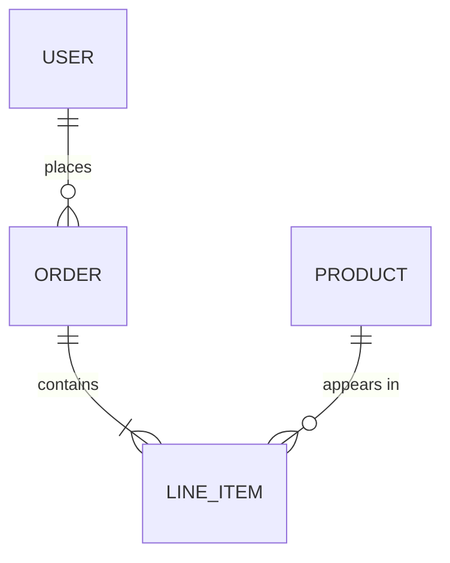
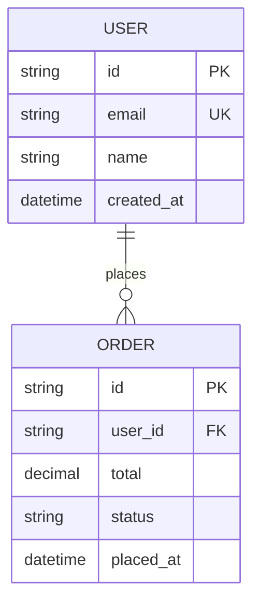
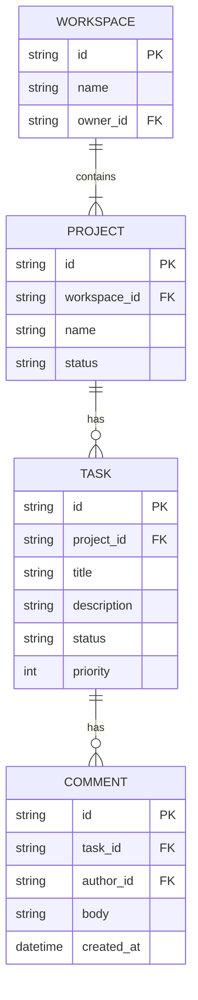
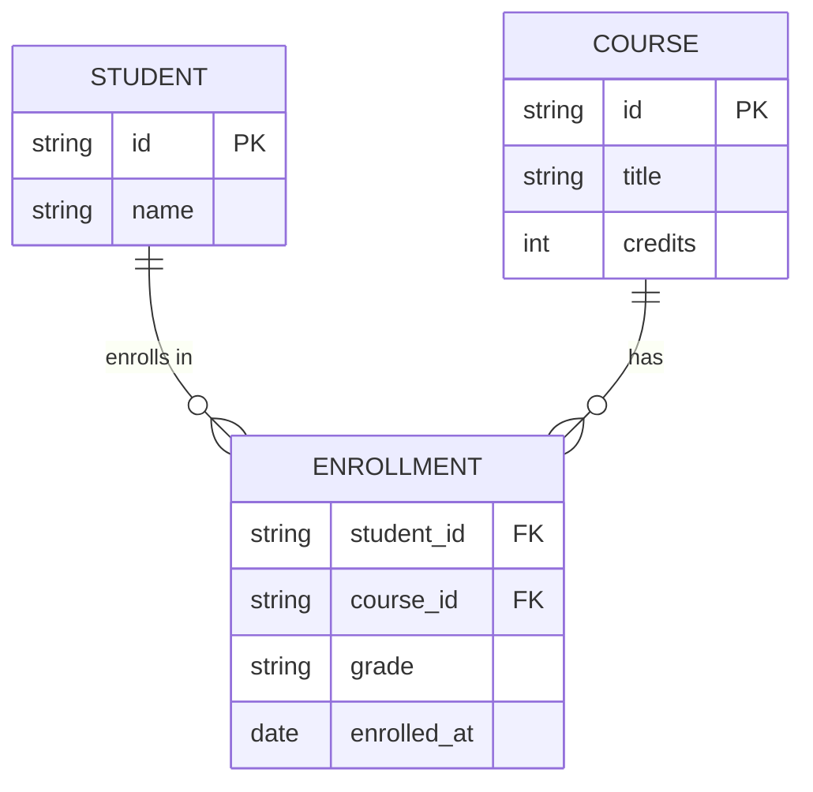

# Entity-Relationship Diagram Guide

## When to Use

Use ER diagrams when the plan involves:
- **Data models** — defining entities and their attributes
- **Database schemas** — tables, columns, and relationships
- **Domain modeling** — mapping business concepts and associations
- **API resource design** — structuring related resources
- **File format design** — defining structured document schemas

## Mermaid Syntax

### Basic Structure

````markdown

````

### Relationship Cardinality

| Left | Right | Meaning |
|------|-------|---------|
| `\|\|` | `\|\|` | Exactly one to exactly one |
| `\|\|` | `o{` | One to zero or more |
| `\|\|` | `\|{` | One to one or more |
| `o\|` | `o{` | Zero or one to zero or more |

Read left-to-right: `USER ||--o{ ORDER` means "one user places zero or more orders."

### Entity Attributes

````markdown

````

### Attribute Markers

| Marker | Meaning |
|--------|---------|
| `PK` | Primary key |
| `FK` | Foreign key |
| `UK` | Unique key |

## Examples

### Content Management System

````markdown

````

### Many-to-Many with Junction Table

````markdown

````

## Tips

- Name entities in UPPER_CASE singular nouns (convention for ER diagrams)
- Always include PK/FK markers to clarify key relationships
- Label relationships with a verb phrase (`places`, `contains`, `belongs to`)
- Keep diagrams to 8-10 entities max — split by bounded context if larger
- Include only the attributes relevant to the plan, not exhaustive schemas
- Use junction tables explicitly for many-to-many relationships
