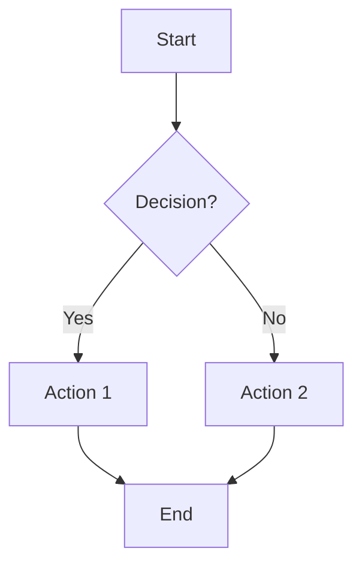
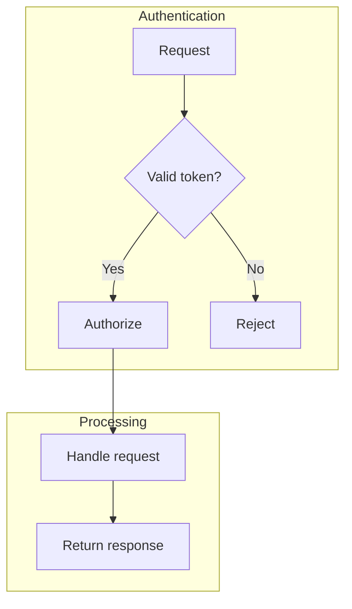
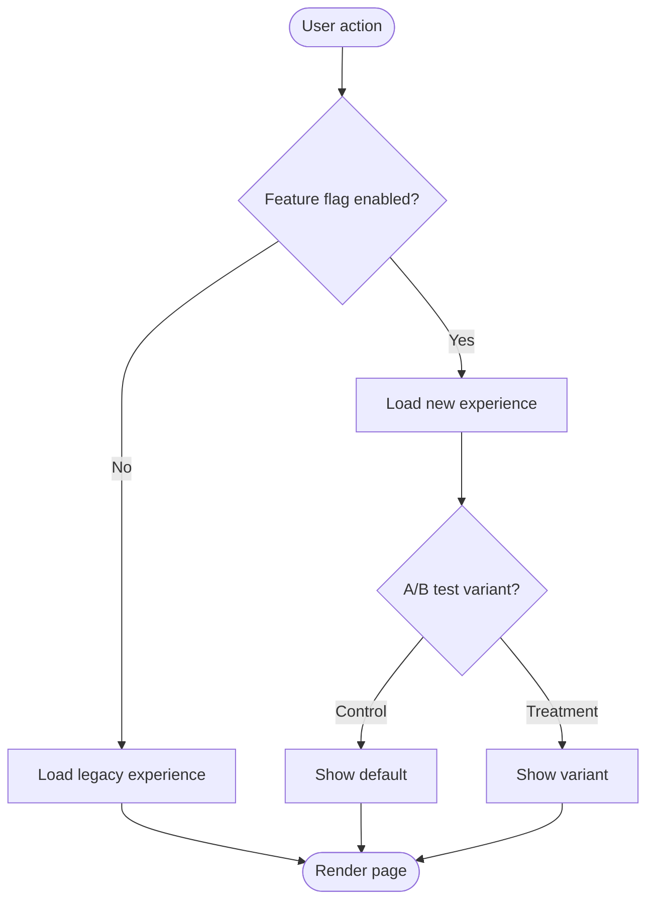
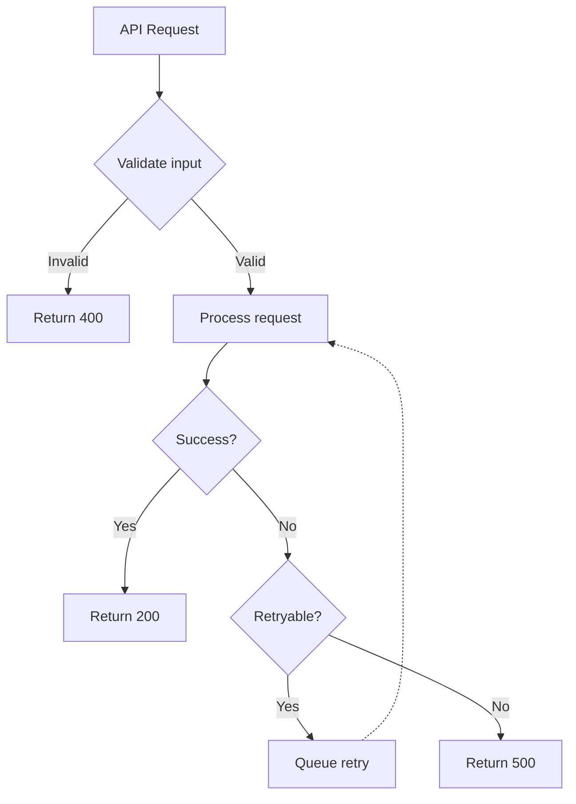

# Flowchart Diagram Guide

## When to Use

Use flowcharts when the plan involves:
- **Decision trees** — branching logic based on conditions
- **Process flows** — multi-step workflows with a clear start and end
- **State machines** — transitions between discrete states
- **Error handling paths** — happy path vs failure scenarios
- **User flows** — step-by-step navigation through an interface

## Mermaid Syntax

### Basic Structure

````markdown

````

### Direction

- `TD` or `TB` — top to bottom (default, best for most flows)
- `LR` — left to right (good for pipelines or timelines)

### Node Shapes

| Syntax | Shape | Use for |
|--------|-------|---------|
| `A[text]` | Rectangle | Actions, steps |
| `A{text}` | Diamond | Decisions, conditions |
| `A([text])` | Stadium | Start/end points |
| `A[(text)]` | Cylinder | Databases, storage |
| `A[[text]]` | Subroutine | Sub-processes |

### Edge Labels

```
A -->|label| B     %% labeled arrow
A -.->|label| B    %% dotted arrow (optional paths)
A ==>|label| B     %% thick arrow (primary path)
```

### Subgraphs

Use subgraphs to group related steps:

````markdown

````

## Examples

### Feature Toggle Flow

````markdown

````

### Error Handling Flow

````markdown

````

## Tips

- Keep flowcharts under 15 nodes — split into multiple diagrams if larger
- Use subgraphs to visually group phases or bounded contexts
- Label edges on decision nodes to make the logic self-documenting
- Use dotted arrows (`-.->`) for optional or retry paths
- Prefer top-down layout for sequential flows, left-right for pipelines
