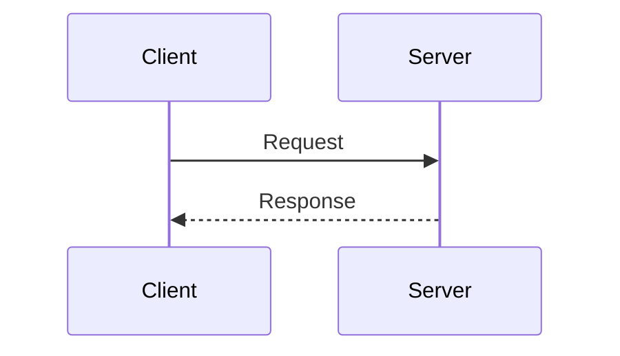
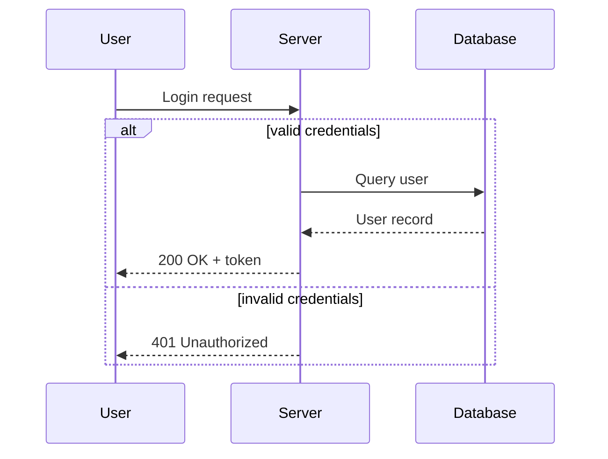
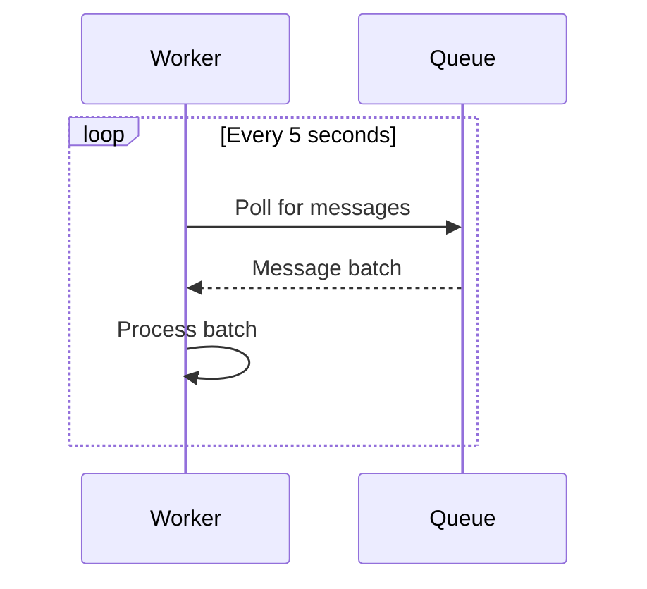
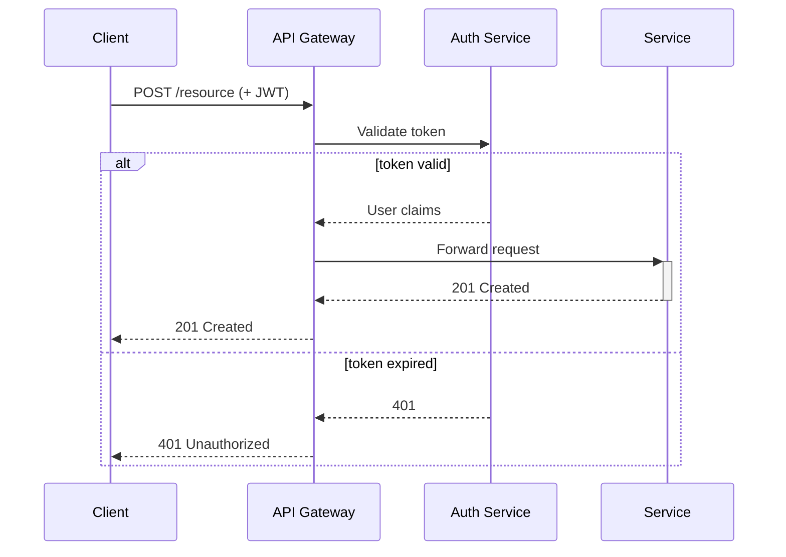
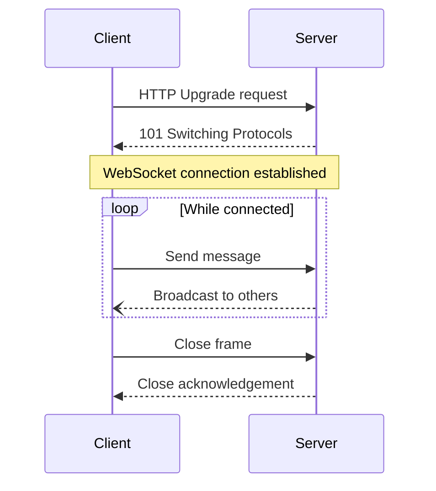

# Sequence Diagram Guide

## When to Use

Use sequence diagrams when the plan involves:
- **API interactions** — request/response flows between client and server
- **Multi-service communication** — microservice choreography or orchestration
- **User-system interactions** — step-by-step user actions and system responses
- **Authentication/authorization flows** — token exchanges, OAuth handshakes
- **Event-driven workflows** — publish/subscribe or message queue interactions

## Mermaid Syntax

### Basic Structure

````markdown

````

### Arrow Types

| Syntax | Meaning | Use for |
|--------|---------|---------|
| `->>` | Solid with arrowhead | Synchronous call |
| `-->>` | Dotted with arrowhead | Response / return |
| `--)` | Solid with open arrow | Async message (fire & forget) |
| `--)`  | Dotted with open arrow | Async response / callback |

### Activation Bars

Show when a participant is actively processing:

```
A->>+B: Request      %% activate B
B-->>-A: Response     %% deactivate B
```

### Conditionals and Loops

````markdown

````

````markdown

````

### Notes

```
Note over A,B: Shared context
Note right of A: Implementation detail
```

## Examples

### REST API with Auth

````markdown

````

### WebSocket Handshake

````markdown

````

## Tips

- Name participants with short aliases (`participant C as Client`) for readability
- Use activation bars (`+`/`-`) to show processing duration on complex flows
- Keep diagrams to 5-6 participants max — split into multiple diagrams if more
- Use `alt`/`else` for branching, `loop` for repeated interactions, `opt` for optional steps
- Add `Note over` annotations for context that doesn't fit in message labels
